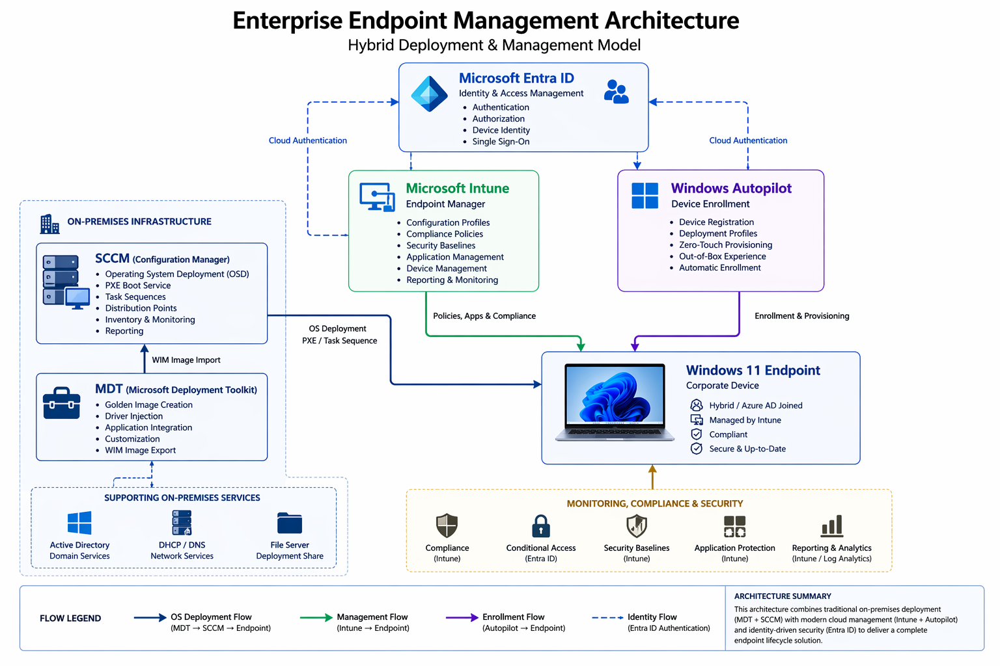

# Enterprise Endpoint Management Lab

## Project Overview

This project simulates a modern enterprise environment for **endpoint deployment, configuration, and management**, combining both **on-premises infrastructure** and **cloud-based solutions**.

The lab was designed to reflect how real organizations manage devices today, where traditional tools like MDT and SCCM still coexist with modern platforms such as Intune and Windows Autopilot.

Instead of focusing on a single technology, this project demonstrates a **full device lifecycle approach**, from imaging and provisioning to configuration, security, and troubleshooting.

---

## Architecture Overview

This architecture represents a hybrid model where:

- **MDT** is used to create standardized golden images  
- **SCCM** handles operating system deployment (OSD) and provisioning  
- **Intune** manages device configuration, compliance, and applications  
- **Windows Autopilot** enables zero-touch device enrollment  
- **Entra ID** acts as the identity backbone for authentication and access  

This reflects a real-world transition from legacy deployment models to modern endpoint management.

---

## Project Structure

enterprise-endpoint-management-lab/
│
├── README.md
│
├── 01-architecture/
├── 02-endpoint-provisioning/
├── 03-configuration-management/
├── 04-application-management/
├── 05-device-enrollment/
├── 06-compliance-and-security/
├── 07-automation-and-validation/
└── 08-operational-troubleshooting/

Each module represents a key stage in the **enterprise endpoint lifecycle**.

---

## Key Objectives

- Simulate a real-world hybrid endpoint management environment  
- Understand the full lifecycle of a corporate device  
- Combine traditional deployment tools with modern cloud management  
- Apply security and compliance practices  
- Develop troubleshooting and validation skills  

---

## Core Components

- **Microsoft Deployment Toolkit (MDT)**  
- **SCCM (Configuration Manager)**  
- **Microsoft Intune**  
- **Windows Autopilot**  
- **Entra ID (Azure Active Directory)**  
- **PowerShell**

---

## Why This Project Matters

Most organizations today are not fully cloud-native.  
They operate in **hybrid environments**, where legacy systems and modern solutions must work together.

This project reflects that reality by:

- Demonstrating how different tools integrate into a single workflow  
- Showing practical implementation of endpoint lifecycle management  
- Highlighting the importance of identity, automation, and security  

---

## Real-World Relevance

This lab aligns directly with responsibilities in roles such as:

- IT Support / Help Desk  
- Systems Administrator  
- Endpoint Engineer  
- Modern Workplace Engineer  

Understanding this architecture helps bridge the gap between **entry-level support roles and more advanced infrastructure positions**.

---

## What This Project Demonstrates

- Hybrid infrastructure design  
- Endpoint deployment and provisioning  
- Cloud device management  
- Identity-driven access control  
- Automation and validation practices  
- Troubleshooting in a multi-system environment  

---

## Next Steps

Each section of this project goes deeper into a specific area:

- Architecture design  
- Device provisioning  
- Configuration management  
- Application deployment  
- Enrollment and identity  
- Security and compliance  
- Automation and validation  
- Troubleshooting  

---

## Conclusion

This project was built to simulate how endpoint management works in a real enterprise environment.

By combining traditional and modern tools, it provides a practical understanding of how devices are deployed, managed, secured, and maintained at scale.
